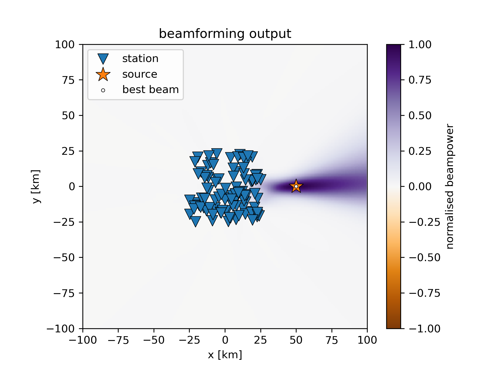

# Fast beamforming in Python

[](https://zenodo.org/badge/latestdoi/684053669)



Cross-correlation beamforming can be realised in a few lines of matrix operations in Python, making use of `pytorch` linear algebra optimisations for speed. For small problems (=smaller than memory), this is fast, efficient and fully parallel. For large problems, this approach fails, specifically when the matrices containing cross correlations become too large for memory. To solve this, we can employ `dask` to divide the computations automatically into multiple tasks than can run across arbitrary infrastructure while retaining much of the same syntax and logic.

We demonstrate this with the notebooks in this repository:

* `beamforming_naive.ipynb`: naive beamforming code, **SLOW** "pure" Python version for teaching purposes only
* `beamforming_numpy.ipynb`: same as above, rewritten in `numpy` using broadcasting etc.
* `beamforming_pytorch.ipynb`: same as above, replacing `numpy` functions with `pytorch` equivalents
* `beamforming_dask.ipynb`: same as above, moving computation of $S$ and beampowers to `dask`.
* [**TODO**] `beamforming_pytorch_field_data.ipynb`: using field data

In these notebooks, the logic and processing are not abstracted away in package of functions. Instead, all processing happens within the notebooks for instructional purposes.

## Performance statistics

These are the runtimes of the cell that performs beamforming (under 3. Beamforming) on a machine with 2x Intel Xeon Gold 6326 (16C/32T), 512 GB RAM for the parameters indicated below:

### `n_sources = 100`

| notebook version | runtime  | speed-up |
| ---------------- | -------- | -------- |
| naive            | 43.9 sec | 1x       |
| numpy            | 11.7 sec | 3.75x    |
| pytorch          | 0.9 sec  | 48.8x    |
| dask             | 1.9 sec  | 23.1x    |

### `n_sources = 1000`

| notebook version | runtime    | speed-up |
| ---------------- | ---------- | -------- |
| naive            | 4861.3 sec | 1x       |
| numpy            | fail       | fail     |
| pytorch          | fail       | fail     |
| dask             | 47.0 sec   | 103.4x   |

Other parameters: `grid_limit = 100`, `grid_spacing = 5`, `window_length = 100`, `sampling_rate = 10`, `fmin, fmax = 0.1, 1.0`


## Note on `dask`

`dask` allows to employ the same algorithm and largely the same syntax as the `pytorch` version, which means one doesn't have to worry about developing a different algorithm that is not memory-limited. However, `dask` also introduces a new optimisation problem: The choice of "good" chunks sizes for the specific system at hand. This is specific to the compute infrastructure used. On the bright side, this has to be optimized only once for a given problem-geometry (number of stations, grid points, frequencies). Visit the [dask documentation](https://docs.dask.org/en/stable/understanding-performance.html) for more details.

## Background

### What is beamforming?

Beamforming is a phase-matching algorithm commonly used to estimate the origin and local phase velocity of a wavefront propagating across an array of sensors. The most basic beamformer is the delay-and-sum beamformer, where recordings across the sensors are phase-shifted and summed (forming the beam) to test for the best-fitting source origin and medium velocity (Rost and Thomas, 2002).

### Cross-correlation beamforming

The cross-correlation beamformer (also Bartlett beamformer, conventional beamformer, etc.) applies the same delay-and-sum idea to correlation functions between all sensor pairs (Ruigrok et al. 2017). This has the major advantage that only the coherent part of the wavefield is taken into account. The major disadvantage is that the computation of cross correlations between all station pairs can become expensive fast, scaling with $n^2$.

A few different formulation of this beamformer exist. We write it in frequency domain as

$B = \sum_\omega \sum_j \sum_{k\neq j} K_{jk}(\omega) S_{kj}(\omega),$

with $B$ the beampower, $K_{jk}(\omega) = d_j(\omega) d^H_k(\omega)$ the cross-spectral density matrix of recorded signals $d$, $S_{kj}(\omega) = s_j(\omega) s^H_k(\omega)$ the cross-spectral density matrix of synthetic signals $s$, $j$ and $k$ identify sensors, and $H$ the complex conjugate. We exclude auto-correlations $j=k$, because they contain no phase-information. Consequently, negative beampowers indicate anti-correlation.

The synthetic signals $s$ (often called replica vectors or Green's functions) are the expected wavefield for a given source origin and medium velocity, most often in acoustic homogeneous half-space $s_j = \exp(-i \omega t_j)$, where $t_j$ is the traveltime from source to each receiver $j$.

### Plane-wave beamforming

In seismology, "beamforming" is often synonymous with plane-wave beamforming. In plane-wave beamforming $t_j$ is the relative travel time from a reference point (commonly center of array) to the sensor $j$ for a given plane-wave

$t_j = \boldsymbol{r_j} \cdot \boldsymbol{u_h}$,

with $\boldsymbol{r_j} = (r_x, r_y)$ the coordinates of sensor $j$ relative to the reference point, and $\boldsymbol{u_h} = u_h(\sin(\theta), \cos(\theta))$ the horizontal slowness vector of the plane-wave, with $u_h$ the horizontal slowness and $\theta$ the direction of arrival. $u_h$ and $\theta$ are the parameters that are tested for (or equivalently $u_x, u_y$). Because plane waves are assumed, the source origin must be enough far away that the plane-wave assumption becomes adequate. The advantage of this is that the spatial dimension is 1 (direction of arrival), which is cheap to compute.

### Matched field processing

When curved wavefronts are allowed, sources may be located within the sensor array and the grid that is tested is defined in space instead of the slowness-domain, adding at least one extra dimension. This is called matched field processing (e.g., Baggeroer et al. 1988). In practice, the difference between plane-wave beamforming and matched field processing lies in the computation of the Green's functions $s_j$, or more precisely the expected traveltimes $t_j$.

In MFP, the travel time is computed as

$t_j = |\boldsymbol{r}_j - \boldsymbol{r}_s| / c$,

with $|\boldsymbol{r}_j - \boldsymbol{r}_s|$ the euclidean distance between sensor and source and $c$ the medium velocity. The parameters tested for in MFP are the source position $\boldsymbol{r}_s$ (2D, 3D) and, sometimes, the medium velocity $c$. A different name for MFP that is intuitive to seismologists may be curved-wave Beamforming.

The beamforming in the notebooks here is Matched Field Processing.

### References

Rost, S. & Thomas, C., 2002. Array seismology: Methods and applications. *Reviews of Geophysics*, **40**, 2–1–2–27. doi:10.1029/2000RG000100

Ruigrok, E., Gibbons, S. & Wapenaar, K., 2017. Cross-correlation beamforming. *J Seismol*, **21**, 495–508. doi:10.1007/s10950-016-9612-6

Baggeroer, A.B., Kuperman, W.A. & Schmidt, H., 1988. Matched field processing: Source localization in correlated noise as an optimum parameter estimation problem. *The Journal of the Acoustical Society of America*, **83**, 571–587. doi:10.1121/1.396151

### Requirements

To run these notebooks, the following is required

* Python
* scientific Python stack (numpy, scipy, matplotlib)
* notebook
* [torch](https://pytorch.org)
* [dask](https://www.dask.org)

A functioning installation can be achieved, e.g., via conda by

```bash
>> conda create -n fast_beamforming python=3.11
>> conda activate fast_beamforming
>> conda install pytorch dask scipy matplotlib notebook
```
