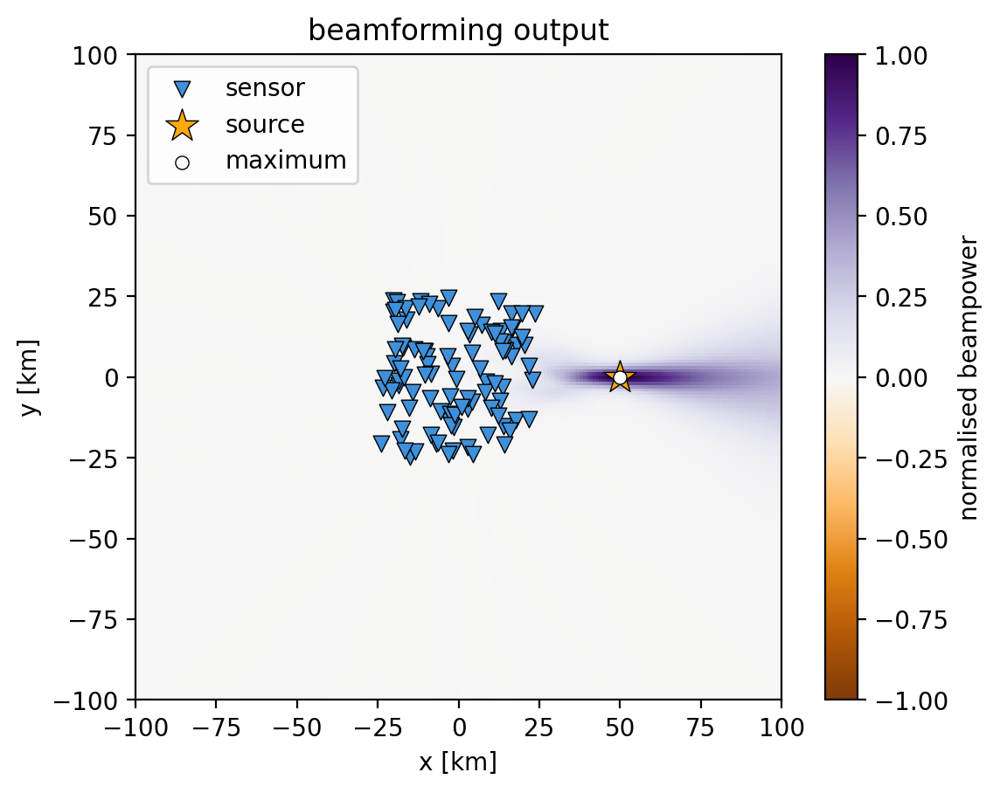
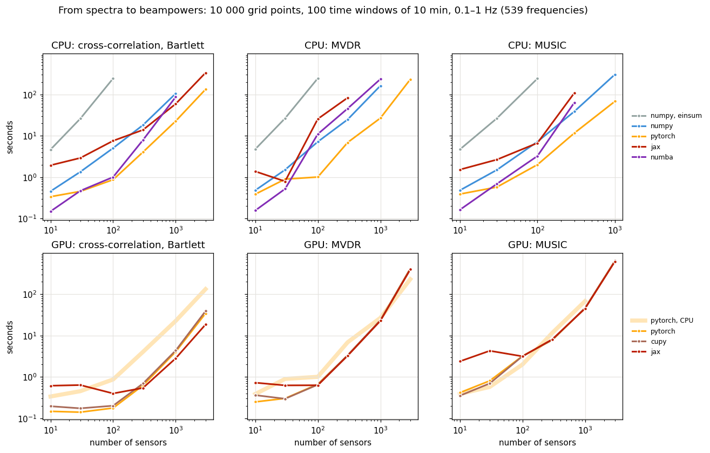
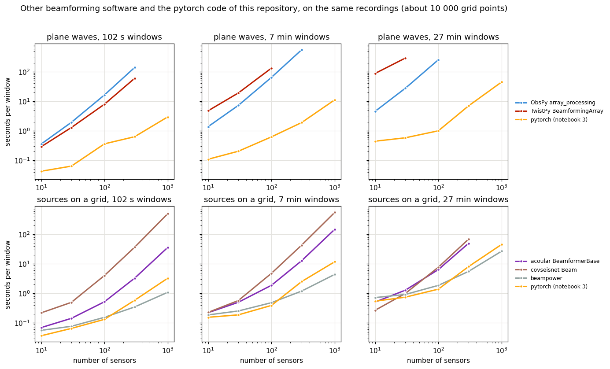

# Fast beamforming in Python

[](https://zenodo.org/badge/latestdoi/684053669)



Beamforming locates sources, and measures the direction and speed of waves, from the recordings of an array of sensors. Six short notebooks show how to compute it in Python: first as plain loops that follow the formula, then with matrix products in numpy, pytorch and other libraries, for the common beamformers (Bartlett, cross-correlation, MVDR, MUSIC), and on field data. The code stays simple on purpose: a beamformer is about ten lines, and yours to adapt.

<br clear="left"/>

## Notebooks

1. **Loops**: what a beamformer computes, written as loops
2. **numpy**: the same with array operations: `einsum`, and matrix products, which are much faster
3. **Other libraries**: the same in pytorch, jax and numba, and how fast they all are
4. **Beamformers**: Bartlett, cross-correlation, MVDR and MUSIC in code, what they can and cannot do, and how to scale beampower to a coherence between 0 and 1
5. **Field data, plane waves**: the Gräfenberg array on the day of the 2011 Tohoku earthquake
6. **Field data, sources on a map**: the 2023 Greenland landslide and seiche, recorded worldwide; first with a constant velocity, then with traveltimes from a velocity model, then with the radiation pattern of the source

Notebooks 1–3 compute exactly the same, on the same synthetic recordings; only the beamforming step differs. Notebooks 5 and 6 are complete examples to adapt to your own data. To run them, install the environment with [uv](https://docs.astral.sh/uv/) (`uv sync`), or `pip install numpy torch jax numba matplotlib obspy cartopy notebook`.

## Which library?

All beamformers here have the same form: a matrix $A$ computed from the cross-spectral density matrix $K$ of the recordings, and $\mathbf{s}^H A\, \mathbf{s}$ for the steering vectors $\mathbf{s}$ of all grid points. `implementations/` has this in numpy, pytorch, jax, cupy and numba, in about 50 lines each. We timed them on one computer (2× Intel Xeon Gold 6326 with 32 cores, NVIDIA A40 GPU): one map of 10 000 grid points, from $K$ averaged over 100 time windows of 10 minutes, 0.1–1 Hz (539 frequencies). The time includes everything from the spectra to the beampowers; the number of windows hardly matters for it. Lines end where a run took longer than a minute. `benchmarks/run.py` measures your own computer.



Seconds, for 100 / 1000 sensors (– : not run, a smaller problem already took longer than a minute):

| | cross-correlation, Bartlett | MVDR | MUSIC |
|---|---|---|---|
| numpy, einsum | 243 / – | 244 / – | 241 / – |
| numpy | 5.0 / 105 | 7.2 / 162 | 7.2 / 303 |
| pytorch | 0.87 / 23 | 1.0 / 27 | 2.0 / 68 |
| jax | 7.6 / 59 | 26 / – | 6.7 / – |
| numba | 1.0 / 87 | 11 / 234 | 3.2 / – |
| pytorch, GPU | 0.18 / 4.1 | 0.67 / 23 | 3.2 / 46 |
| cupy, GPU | 0.20 / 4.4 | 0.65 / 24 | 3.2 / 46 |
| jax, GPU | 0.40 / 2.8 | 0.63 / 23 | 3.2 / 45 |

- **Write it as a matrix product**: 50× faster than `einsum` in numpy.
- **On a CPU, use pytorch**: the fastest for every beamformer, 4–7× faster than numpy, for a few changed lines. numba's compiled loops keep up to about 100 sensors.
- **On a GPU**, pytorch, cupy and jax are about equally fast: 5× faster than the CPU for cross-correlation. For MVDR and MUSIC with 1000 sensors the GPU gains little, because the inverse and the eigenvectors of $K$ take most of the time.
- The grid search grows with the number of sensors squared, the inverse and the eigenvectors with its cube.

All runs use single precision for the grid search, which is accurate enough for beamforming and can speed up computation dramatically.

## Comparison with other beamforming software

The same synthetic recordings, beamformed with each tool as its documentation suggests, and with the pytorch code of notebook 3 (`benchmarks/compare.py`): plane waves on a 101 × 101 slowness grid, and sources on a 100 × 100 grid, for single time windows of 102 s, 7 min and 27 min. Each tool runs with its own defaults; some use all cores, some one. Lines end where a window took longer than 30 minutes or did not fit into memory.



All tools find the source, and where they use the same grid, their maps agree with ours (correlation 0.90–1.00). TwistPy finds the direction exactly, but its slowness is off by up to 56 %: it uses steering vectors at a single frequency. With 100 sensors, the ten lines of pytorch are 4–250× faster than ObsPy, TwistPy, acoular and covseisnet. beampower, a compiled delay-and-sum of the waveforms, grows only linearly with the number of sensors and is up to 3× faster than pytorch with 1000 of them; it computes the Bartlett beamformer only, which doesn't strictly require computing $K$ and can be made much faster. We focus on $K$-driven implementations for easier implementation of MVDR and MUSIC. The other tools we compare against do much more than beamforming; where the beamforming step itself is slow, a few lines of your own can take over.

## Large problems

How much memory does a problem need? Three arrays matter, each with 16 bytes per number (8 in single precision):

| array | size | 1 GB at |
|---|---|---|
| steering vectors of one frequency (and $\mathbf{s}^H K$, as large again) | grid points × sensors | 67 000 grid points × 1000 sensors |
| $K$ of one frequency | sensors² | 8000 sensors |
| spectra of all time windows | windows × sensors × frequencies | a week of 10-minute windows × 100 sensors × 539 frequencies |

So a laptop with 8 GB handles the benchmark problem above (160 MB per frequency), but not a 3D grid of 100³ points with 1000 sensors (16 GB of steering vectors per frequency), nor a month of windows from 1000 sensors (37 GB of spectra). $K$ for all frequencies at once, as in some of the notebooks, is 8.6 GB for 1000 sensors and 539 frequencies.

All three can be solved by doing one piece at a time; no extra library is needed. Loop over the frequencies (as the implementations do), over chunks of the grid, and keep the spectra on disk, stored with the frequency as first axis, so that one frequency is read at a time:

```python
spectra = np.load("spectra.npy", mmap_mode="r")  # (frequencies, sensors, windows), stays on disk
beampowers = np.zeros(len(gridpoints))
for w in range(len(omega)):
    d = np.asarray(spectra[w])  # one frequency in memory: (sensors, windows)
    K = d @ d.conj().T / d.shape[1]
    np.fill_diagonal(K, 0)
    for x in range(0, len(gridpoints), 10_000):  # 10 000 grid points at a time
        chunk = slice(x, x + 10_000)
        traveltimes = np.linalg.norm(gridpoints[chunk, None] - stations[None], axis=2) / medium_velocity
        s = np.exp(-1j * omega[w] * traveltimes)
        beampowers[chunk] += np.sum((s.conj() @ K) * s, axis=1).real
```

The first version of this repository used [dask](https://www.dask.org) for this. With the loops above, the pieces are already independent and small, and dask would only add a scheduler; it is worth it if you want to spread the pieces over several computers. What remains is $K$ itself: beyond about 20 000 sensors (6 GB per frequency) it does not fit, and its inverse and eigenvectors become very slow. Then beamform sub-arrays, or, for Bartlett and cross-correlation only, use the delay-and-sum form of the recordings, which needs no $K$ (see below).

## What happened to this repository?

The first version of this repository (release [v1.0](https://github.com/schipp/fast_beamforming/releases/tag/v1.0); its notebooks are in `archive/`) wrote the beamformer as the match between two cross-spectral density matrices, $\sum K_{jk} S_{kj}$, with $S$ the matrix of the synthetics. That shows nicely that recordings and synthetics are treated alike, but $S$ has one entry per grid point, pair of sensors and frequency, and quickly fills any memory. The dask and hybrid notebooks existed to work around that. This version:

- writes the beamformer as usual, $\mathbf{s}^H K\, \mathbf{s}$, with the steering vectors $\mathbf{s}$. $S$ is never needed; neither by this nor by any other beamformer, including MVDR and MUSIC. That takes away most of the memory problem; for what remains, see "Large problems".
- computes it with matrix products, frequency by frequency, and compares numerical libraries for exactly this computation, for four beamformers, on CPUs and GPUs (notebook 3, `benchmarks/run.py`).
- explains the beamformers, in code (notebook 4), and compares with other beamforming software (`benchmarks/compare.py`).
- condenses the plane-wave and field-data notebooks into one example (notebook 5), and replaces the geographic notebook by an example on the globe, with traveltimes from a velocity model (notebook 6).

## Technical background

### What is beamforming?

Beamforming is a phase-matching algorithm commonly used to estimate the origin and local phase velocity of a wavefront propagating across an array of sensors. The most basic beamformer is the delay-and-sum beamformer, where recordings across the sensors are phase-shifted and summed (forming the beam) to test for the best-fitting source origin and medium velocity (Rost and Thomas, 2002).

### Cross-correlation beamforming

The cross-correlation beamformer applies the same delay-and-sum idea to the correlation functions between all sensor pairs (Ruigrok et al. 2017). This has the advantage that only the coherent part of the wavefield is taken into account. In the frequency domain,

$B = \sum_\omega \mathbf{s}^H K\, \mathbf{s} = \sum_\omega \sum_j \sum_{k\neq j} s_j^*(\omega)\, K_{jk}(\omega)\, s_k(\omega),$

with $B$ the beampower, $K_{jk}(\omega) = d_j(\omega) d^*_k(\omega)$ the cross-spectral density matrix of the recordings $d$, $j$ and $k$ the sensors, and $^*$ the complex conjugate. The steering vector $s_j = \exp(-i \omega t_j)$ holds the expected traveltimes $t_j$ from a candidate source to each sensor. Each term shifts the correlation of a pair of sensors by the time lag expected between them. We exclude auto-correlations $j=k$, because they contain no phase information; consequently, negative beampowers indicate anti-correlation. With the auto-correlations, this is the Bartlett (or conventional) beamformer.

Because $K$ is built from the recordings, the sum also equals the energy of the delay-and-sum beam of the recordings, minus the auto-correlations: $B = \sum_\omega |\sum_j d_j s_j^*|^2 - \sum_\omega \sum_j |d_j|^2$. This costs $n_\text{sensors}$ instead of $n_\text{sensors}^2$ operations per grid point and frequency, but for every time window, and it does not carry over to the beamformers below, or to correlations that are processed pair by pair. This repository therefore works with $K$ throughout.

### MVDR

The MVDR (minimum variance distortionless response, or Capon) beamformer uses the inverse of $K$ (Capon, 1969):

$B = \sum_\omega \frac{1}{\mathbf{s}^H K^{-1} \mathbf{s}}.$

It is the power that remains when the array is weighted to pass a wave from the candidate source unchanged, while letting through as little as possible of everything else. It separates sources that the Bartlett beamformer merges into one peak. The price: $K$ must be averaged over many time windows, ideally more than there are sensors (from a single window, MVDR and MUSIC only redraw the Bartlett map on another scale, see notebook 4). For results over time, each time step therefore needs several shorter windows. Also, a small number is added to its diagonal to keep the inverse stable ("diagonal loading"), and errors in the velocity model or the sensor positions quickly weaken the peak.

### MUSIC

MUSIC (multiple signal classification; Schmidt, 1986) splits the eigenvectors of $K$ into those with the largest eigenvalues, one per source, and the rest, the noise subspace $E_n$:

$B = \sum_\omega \frac{1}{\mathbf{s}^H E_n E_n^H\, \mathbf{s}}.$

The steering vector of a true source is orthogonal to the noise subspace, so the denominator is close to zero there: a very sharp peak. MUSIC resolves close sources best, but the number of sources must be chosen, its output is not a power, and it is the most sensitive to errors in the model. Notebook 4 compares all four beamformers.

### Plane-wave beamforming

In seismology, "beamforming" is often synonymous with plane-wave beamforming. In plane-wave beamforming $t_j$ is the relative travel time from a reference point (commonly center of array) to the sensor $j$ for a given plane-wave

$t_j = -\boldsymbol{u_h} \cdot \boldsymbol{r_j}$,

with $\boldsymbol{r_j} = (r_x, r_y)$ the coordinates of sensor $j$ relative to the reference point, and $\boldsymbol{u_h} = u_h(\sin(\theta), \cos(\theta))$ the horizontal slowness vector of the plane-wave, with $u_h$ the horizontal slowness and $\theta$ the back-azimuth (the direction towards the source). $u_h$ and $\theta$ are the parameters that are tested for (or equivalently $u_x, u_y$). Because plane waves are assumed, the source origin must be far enough away that the plane-wave assumption becomes adequate.

### Matched field processing

When curved wavefronts are allowed, sources may be located within the sensor array and the grid that is tested is defined in space instead of the slowness-domain, adding at least one extra dimension. This is called matched field processing (e.g., Baggeroer et al. 1988). In practice, the difference between plane-wave beamforming and matched field processing lies in the computation of the steering vectors $s_j$, or more precisely the expected traveltimes $t_j$.

In MFP, the travel time is computed as

$t_j = |\boldsymbol{r}_j - \boldsymbol{r}_s| / c$,

with $|\boldsymbol{r}_j - \boldsymbol{r}_s|$ the euclidean distance between sensor and source and $c$ the medium velocity. The parameters tested for in MFP are the source position $\boldsymbol{r}_s$ (2D, 3D) and, sometimes, the medium velocity $c$. A different name for MFP that is intuitive to seismologists may be curved-wave beamforming.

### References

Rost, S. & Thomas, C., 2002. Array seismology: Methods and applications. *Reviews of Geophysics*, **40**, 2–1–2–27. doi:10.1029/2000RG000100

Ruigrok, E., Gibbons, S. & Wapenaar, K., 2017. Cross-correlation beamforming. *J Seismol*, **21**, 495–508. doi:10.1007/s10950-016-9612-6

Baggeroer, A.B., Kuperman, W.A. & Schmidt, H., 1988. Matched field processing: Source localization in correlated noise as an optimum parameter estimation problem. *The Journal of the Acoustical Society of America*, **83**, 571–587. doi:10.1121/1.396151

Svennevig, K., Hicks, S. P., Forbriger, T., Lecocq, T., Widmer-Schnidrig, R., Mangeney, A., et al., 2024. A rockslide-generated tsunami in a Greenland fjord rang Earth for 9 days. *Science*, **385**, 1196–1205. doi:10.1126/science.adm9247

Capon, J., 1969. High-resolution frequency-wavenumber spectrum analysis. *Proceedings of the IEEE*, **57**, 1408–1418. doi:10.1109/PROC.1969.7278

Schmidt, R., 1986. Multiple emitter location and signal parameter estimation. *IEEE Transactions on Antennas and Propagation*, **34**, 276–280. doi:10.1109/TAP.1986.1143830

## Repository layout

```
notebooks/          the six notebooks; download and traveltime scripts for notebook 6
implementations/    the same beamformer in different libraries
benchmarks/         speed measurements (run.py, compare.py) and figures (plot.py); results in results/
tests/              every implementation against the definition
archive/            the notebooks of the first version (release v1.0)
```
